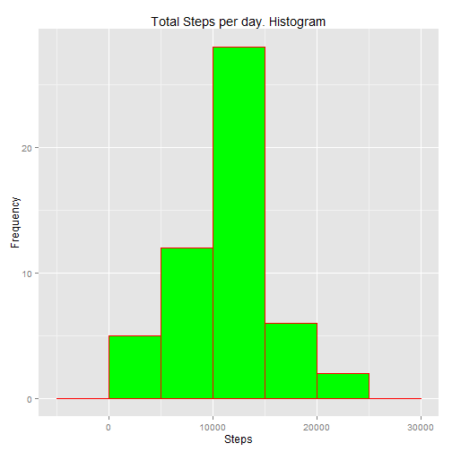
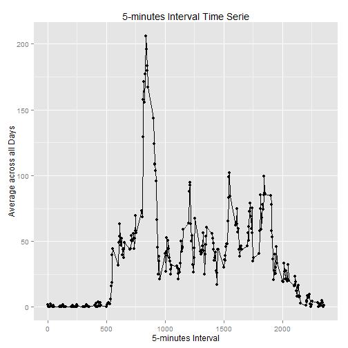
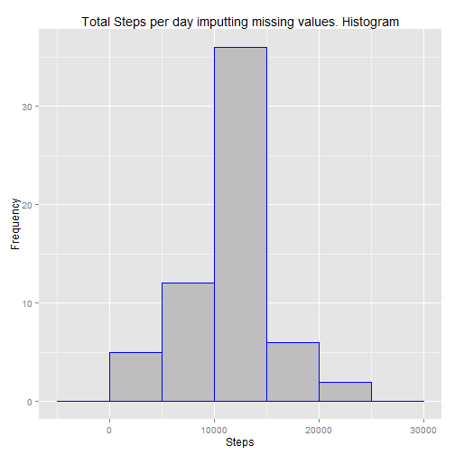
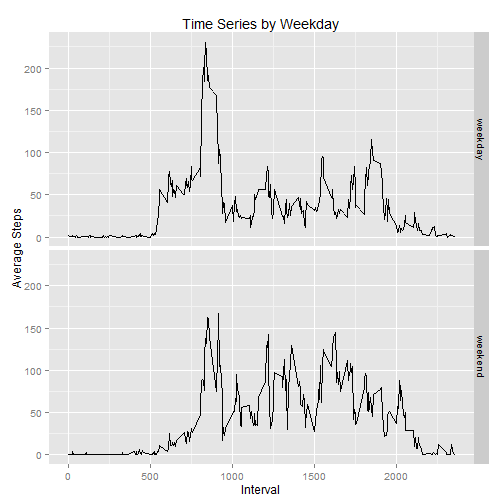

## Loading and preprocessing the data


```r
library(dplyr, warn.conflicts = F)
library(ggplot2, warn.conflicts = F)


activity<-read.csv("activity.csv")
```


## What is mean total number of steps taken per day?


```r
#Reshaping and calculating steps per day

filterAct<- filter(activity, !is.na(steps))
byDate<- group_by(filterAct, date)
sumSteps<- summarize(byDate, steps = sum(steps))
head(sumSteps)
```

```
## Source: local data frame [6 x 2]
## 
##         date steps
##       (fctr) (int)
## 1 2012-10-02   126
## 2 2012-10-03 11352
## 3 2012-10-04 12116
## 4 2012-10-05 13294
## 5 2012-10-06 15420
## 6 2012-10-07 11015
```

```r
#The histogram

ggplot(sumSteps, aes(x=steps)) + 
  geom_histogram(binwidth=5000, colour="red", fill="green") +
  ggtitle("Total Steps per day. Histogram") +
  xlab("Steps") + ylab("Frequency")
```

 

The mean of the total number of steps is:


```r
mean(sumSteps$steps)
```

```
## [1] 10766.19
```

And the median is:


```r
median(sumSteps$steps)
```

```
## [1] 10765
```


## What is the average daily activity pattern?


```r
byInterval<- group_by(filterAct, interval)
MeanInt<- summarize(byInterval, MeanInterval=mean(steps))

qplot(x = interval, y=MeanInterval ,data=MeanInt,
            ylab="Average across all Days",
            xlab="5-minutes Interval",
            main="5-minutes Interval Time Serie") + geom_line()
```

 

```r
filter(MeanInt, MeanInterval == max(MeanInterval))%>% select(interval)
```

```
## Source: local data frame [1 x 1]
## 
##   interval
##      (int)
## 1      835
```


## Imputing missing values

```r
activityNA<-is.na(activity$steps)

sum(activityNA)
```

```
## [1] 2304
```

```r
# Imputting missing values

activity2<- activity
activity2<- merge(x=activity2, y=MeanInt, by.x = "interval", by.y = "interval")
activity3 <- filter(activity2, is.na(steps)) %>% select(MeanInterval, date,interval)
names(activity3)<- c( "steps","date", "interval")

activity4<- arrange(rbind(filterAct, activity3), date, interval)

byDate2<- group_by(activity4, date)
sumSteps2<- summarize(byDate2, steps=sum(steps))

ggplot(sumSteps2, aes(x=steps)) + 
  geom_histogram(binwidth=5000, colour="blue", fill="grey") +
  ggtitle("Total Steps per day imputting missing values. Histogram") +
  xlab("Steps") + ylab("Frequency")
```

 

The new mean and median do not differ significantly to the previous ones. This might to be because the strategy taken. We replaced the missing data with the mean of the interval. These are the new mean and median:


```r
mean(sumSteps2$steps)
```

```
## [1] 10766.19
```

```r
median(sumSteps2$steps)
```

```
## [1] 10766.19
```


## Are there differences in activity patterns between weekdays and weekends?


```r
# Weekdays and Weekend


activity4 <- mutate(activity4, WeekDay = ifelse(weekdays(as.Date(date)) %in% c("Sunday" , "Saturday"), "weekend", "weekday"))
activity4$WeekDay<- as.factor(activity4$WeekDay)

byIntervalWeekday<- group_by(activity4, interval, WeekDay)
MeanIntWeekday<- summarize(byIntervalWeekday, MeanInterval=mean(steps))

print(qplot(x = interval, y=MeanInterval,data=MeanIntWeekday, 
            geom="line",
            ylab="Average Steps",
            xlab="Interval",
            main="Time Series by Weekday") + 
        facet_grid(WeekDay~.))
```

 

